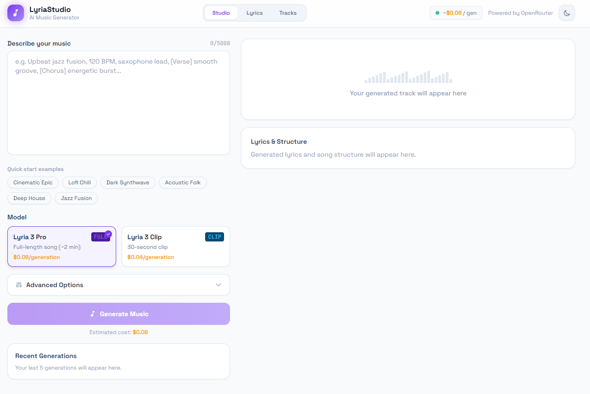
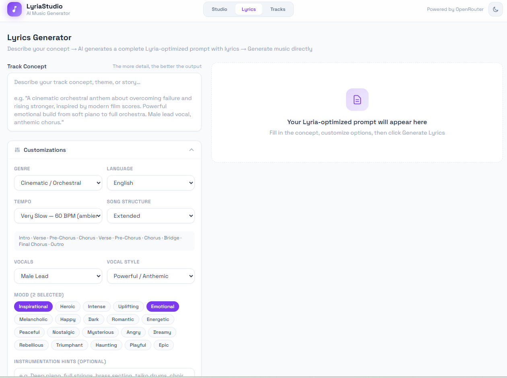
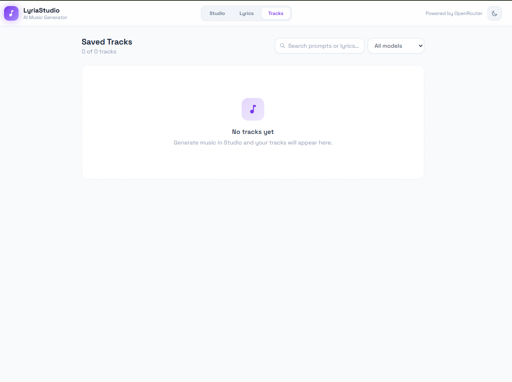

# 🎵 LyriaStudio

> AI-powered browser-based music generation studio for creating complete songs, lyrics, and downloadable AI music tracks with advanced customization.



---

# ✨ Features

## 🎼 AI Music Generation

Generate complete AI music tracks directly in the browser.

### Supported Outputs

* Full-length songs (~4 minutes)
* Short clips (~30 seconds)
* Structured song compositions
* AI-generated lyrics

### Models

| Model        | Description           |
| ------------ | --------------------- |
| Lyria 3 Pro  | Full song generation  |
| Lyria 3 Clip | Short clip generation |

---

# ✍️ Lyrics Generator

Generate optimized lyrics and song structures using AI.

### Includes

* Verses
* Chorus
* Pre-Chorus
* Bridge
* Outro

### Customization Options

* Genre
* Tempo
* Mood
* Vocal Style
* Instrumentation Hints
* Song Structure

---

# 🎛️ Advanced Customization

## 🎹 Genres

* Cinematic / Orchestral
* LoFi Chill
* Jazz Fusion
* Dark Synthwave
* Deep House
* Acoustic Folk
* Ambient
* Epic
* Pop
* EDM

---

## 😊 Mood Selection

* Inspirational
* Emotional
* Heroic
* Uplifting
* Dark
* Romantic
* Energetic
* Nostalgic
* Dreamy
* Epic

---

## 🎤 Vocal Options

* Male Lead
* Female Lead
* Instrumental
* Duet

---

## 🎚️ Tempo Control

* Very Slow
* Slow
* Medium
* Fast
* BPM-based presets

---

# 💾 Browser-Based Storage

LyriaStudio is fully frontend-based and runs entirely in the browser.

### Data Storage

Generated tracks and metadata are stored using:

* LocalStorage
* IndexedDB *(optional implementation)*

### Benefits

* No backend required
* Fast performance
* Privacy-friendly
* Easy deployment
* Offline-capable architecture

---

# ⬇️ Download Generated Tracks

Users can:

* Download generated music tracks
* Save prompts
* Save generated lyrics
* Revisit previous generations
* Manage tracks locally

---

# 🖼️ Screenshots

---

## 🎹 Studio Page

Generate complete AI music tracks.


---

## ✍️ Lyrics Generator

Create detailed lyrics and optimized music prompts.



---

## 🎵 Saved Tracks

Manage previously generated music tracks.



---

# 🛠️ Tech Stack

## Frontend

* React.js
* Vite
* Tailwind CSS
* JavaScript / TypeScript

## AI APIs

* OpenRouter API
* AI Music Models
* LLM-based Lyrics Generation

## Storage

* Browser LocalStorage
* IndexedDB

---

# 📦 Installation

## Clone Repository

```bash
git clone https://github.com/yourusername/lyriastudio.git
cd lyriastudio
```

---

# 📥 Install Dependencies

```bash
npm install
```

---

# ⚙️ Environment Variables

Create a `.env` file in the root directory.

```env
VITE_OPENROUTER_API_KEY=your_api_key
```

---

# ▶️ Run Development Server

```bash
npm run dev
```

Application runs at:

```bash
http://localhost:5173
```

---

# 🏗️ Build for Production

```bash
npm run build
```

---

# 👀 Preview Production Build

```bash
npm run preview
```

---

# 📂 Project Structure

```bash
lyriastudio/
│
├── public/
│
├── src/
│   ├── components/
│   ├── pages/
│   ├── hooks/
│   ├── services/
│   ├── store/
│   ├── utils/
│   ├── styles/
│   └── assets/
│
├── screenshots/
│
├── .env.example
├── package.json
├── vite.config.js
├── tailwind.config.cjs
└── README.md
```

---

# 🚀 Core Functionalities

## 🎵 Music Generation Workflow

1. Enter music description
2. Select generation model
3. Customize options
4. AI generates:

   * Music
   * Lyrics
   * Song structure
5. Track saved locally in browser
6. User downloads generated audio

---

# ✍️ Lyrics Generator Workflow

1. Enter concept/story
2. Select:

   * Genre
   * Mood
   * Tempo
   * Vocal style
3. AI creates:

   * Optimized prompt
   * Lyrics
   * Song structure

---

# 🎨 UI Features

* Modern clean interface
* Responsive design
* Browser-only architecture
* Fast generation flow
* Lightweight UI
* Dark mode support
* Minimal user experience

---

# 🌐 Deployment

Because LyriaStudio is frontend-only, deployment is extremely simple.

## Deploy On

* Vercel
* Netlify
* GitHub Pages
* Cloudflare Pages

---

# 🔥 Example Prompt

```text
Upbeat cinematic rock anthem with emotional male vocals, powerful chorus, orchestral strings, electric guitars, uplifting energy, 120 BPM
```

---

# 📌 Browser Storage Example

Tracks are stored locally in the browser:

```javascript
localStorage.setItem("tracks", JSON.stringify(tracks));
```

---

# 🔒 Privacy Friendly

Since everything runs in the browser:

* No user database
* No server storage
* No backend infrastructure
* User data stays local

---

# 🧪 Scripts

| Command         | Description              |
| --------------- | ------------------------ |
| npm run dev     | Start development server |
| npm run build   | Create production build  |
| npm run preview | Preview production build |

---

# 🚀 Future Improvements

* 🎧 Waveform visualization
* 🎤 Voice cloning
* 🎼 MIDI export
* ☁️ Cloud sync
* 📱 Mobile app
* 🔊 Audio mastering
* 🤝 Collaboration features
* 🧠 Custom AI fine-tuning

---

# 🤝 Contributing

Contributions are welcome.

```bash
# Fork repository

# Create new branch
git checkout -b feature-name

# Commit changes
git commit -m "Added feature"

# Push branch
git push origin feature-name
```

---

# 📄 License

MIT License

---

# 👨‍💻 Author

## Sasikumar

Full Stack Developer • AI Builder • Creative Technologist

### Skills

* AI Applications
* React Development
* Frontend Engineering
* Automation Systems
* Music AI Tools

---

# ⭐ Support

If you like this project:

* Star the repository ⭐
* Share with others
* Contribute improvements

---

# 📬 Contact

* GitHub: [https://github.com/sasijarvis](https://github.com/sasijarvis)

---

# 🎵 LyriaStudio

### “Turn imagination into music with AI.”
